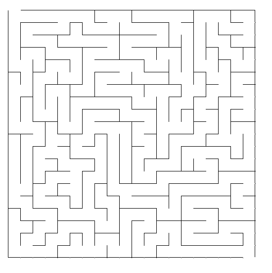

# Maze-generation
Maze generation using different [maze algorithms](https://en.wikipedia.org/wiki/Maze_generation_algorithm). Additionally, some pathfinders was also implemented. 
Thus far it's only working with mazes that was genereted with recursive backtracking. The start point is always at the upper left corner and the end point is at the lower right corner.

Pygame was used to visualize the maze generation and the pathfinding process.

### List of maze algorithms
- [x] Recursive backtracking 
- [x] Prims 
- [x] Hunt and kill
- [x] Kruskal 
- [x] Binary tree 
- [x] Growing tree

### List of pathfinders
- [x] Recursive backtracking
- [x] A* search

### How to run
Download the packages in the requirements file:

    pip install -r requirements.txt

To start the screen run the following command:

    py main.py

When the screen appears with a 2D grid, press either button to start the maze generation. To generate a new maze simply
click either buttons again when the current generation has finished. The different buttons represent the different algorithms.

### Commands
You can also use commands to start the generation or exit the screen. The only way to start pathfinder is with commands.

| Command | Description |
| ------- | ----------- |
| `p` | Run Prims algorithm |
| `r` | Run Recursive backtracking |
| `h` | Run Hunt and kill |
| `b` | Run Binary tree |
| `g` | Run Growing tree |
| `k` | Run Kruskal |
| `1` | Run A* star search |
| `2` | Run Recursive backtracking |
| `esc` | Exit |

## Visualizations
### Maze generations

<blockquote>

    

        Recursive backtracking
    

    

    

        Prims
    

    

    

        Hunt and kill
    

    

    

        Binary tree
    

    

        Growing tree
    

    

        Kruskal
    

</blockquote>

### Pathfinders
<blockquote>

    

        Recursive backtracking
    

    

    

    

        A star search
    

    

    

</blockquote>
