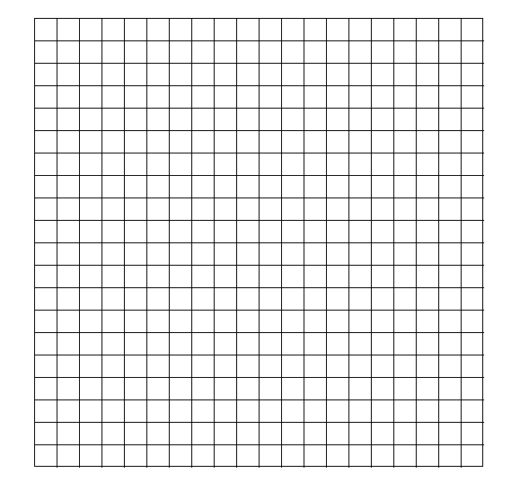

# Maze-generation
Simple maze generation using [recursive backtracking](https://en.wikipedia.org/wiki/Maze_generation_algorithm).
Pygame was used to visualize the process.

### How to run
Download Pygame if you don't already have it:

    pip install pygame

To start the screen run the following command:

    py main.py

When the screen appears with a 2D grid, press s to start the maze generation. To generate a new maze simply
click s again when the current generation has finished.

To exit simply click on the x on the upper right corner of the screen.

