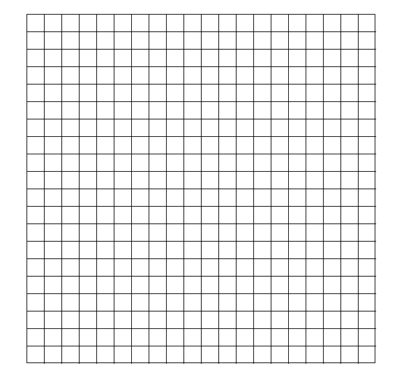

# Maze generation - recursive backtracking
There are multiple [maze generation algorithms](https://en.wikipedia.org/wiki/Maze_generation_algorithm) that generates
mazes which can differ fundamentally in how the maze turns out aesthetically. For this implementation the most simple
recursive backtracking algorithm was used, which uses a DFS to visit all the cells and at each cell removes the line between
the current cell and the adjacent cell that it moves to. 

This particular implementation was different than the other algorithm implementations I made, since it involved the visualization of the algorithm. PyGame was used to
visualize the maze generation process and mostly where the tedious work went into. 

### How to run
To run the visualization you have to download pygame via pip and then simply type ``py mazedrawer.py`` while being in the same folder as the file ``100-algorithm-challenge/#017 Maze generation`` and 
press the key "s" to start the visualization. To end it click on the cross button on the upper right corner.
